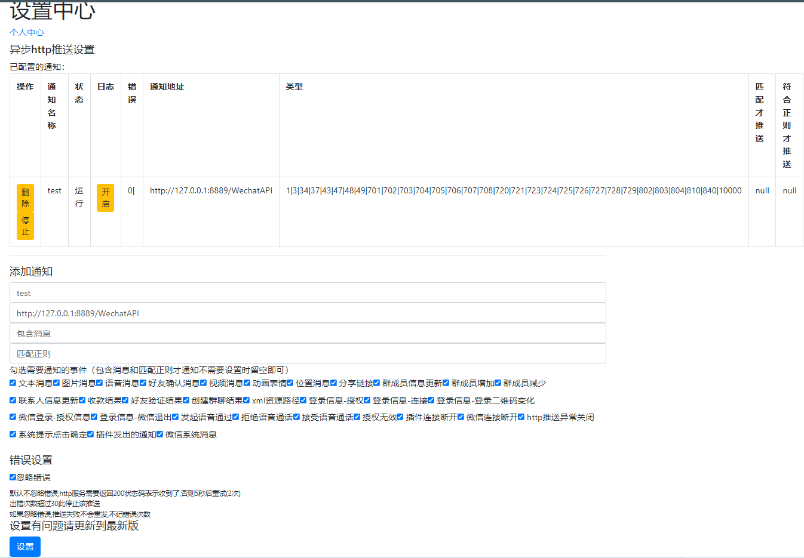

# E小天python demo

## 安装工具
- python
- pycharm（推荐）

## 需要的模块
```
Flask
gevent
requests
xmltodict
```

## 如何使用

1. 在e小天里设置推送消息地址，地址：_http://127.0.0.1:8889/WechatAPI_
    
2. 运行`demo.py`后会启动微信并抖一抖，在抖一抖的微信里登陆账号
3. 去e小天里授权即可

## 文档

- [机器人API接口参考官方文档](https://github.com/wxext/wxext/blob/master/docs/home/README.md#%E5%90%AF%E5%8A%A8%E5%8A%9F%E8%83%BD)
- API传递参数可以参考 **wechat.py**

启动三个线程，本地服务器、接受消息（处理）、发送消息
1. 把回调接口on_message传给**本地服务器**，拿消息
2. 把实例的机器人wechat_manager传给 **发送消息**，以调用接口

```
wechat_manager = WechatAPI()  # 实例机器人
threading.Thread(target=wechat_manager.start, args=(on_message,)).start()  # 启动机器人服务
threading.Thread(target=message_queue_consumer).start()  # 消息处理服务
threading.Thread(target=sent_msg_consumer, args=(wechat_manager,)).start()  # 消息发送服务
```

on_message是一个回调接口，他的作用是获取e小天推送过来的消息，message就是消息内容
1. 接收到的消息会存在**receive_message_queue**队列里
```
def on_message(message):  # 回调接口，e小天推过来的消息都可以在这里拿到
    print(message)  # 打印e小天推送过来的消息内容
    global message_exclude_repeat
    message_str = str(message)
    if message_exclude_repeat:
        if message_str == message_exclude_repeat:
            return
    message_exclude_repeat = message_str
    receive_message_queue.put(message)
```

消息经过MessageProcessing.py处理后，会把需要发送的消息通过sent_queue_msg(build_queue_msg(response_msg))存进sent_queue，发送消息服务会依次取，然后调接口发送。
```
MessageProcessing.py
def single_message(self):
    if not self.is_receive():
        return
    response_msg = ''
    # 文字消息
    response_msg = self.deal_single()

    if response_msg:
        response_msg["pid"] = self.pid
        response_msg["wx_id"] = self.wx_id
        sent_queue_msg(build_queue_msg(response_msg))

SentConsumer.py
# 发送消息队列
sent_queue = Queue()

def build_queue_msg(msg):
    return msg

def sent_queue_msg(msg):
    sent_queue.put(msg)
```
